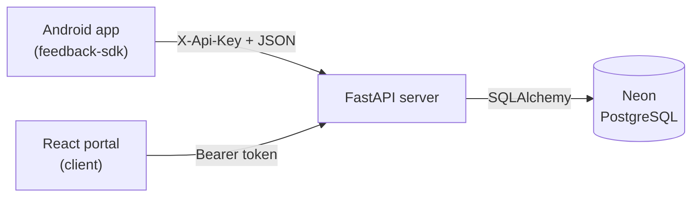

# 📚 Feedback SDK — Documentation

Welcome to the documentation for **Feedback SDK**, a lightweight Android SDK for collecting structured, in-app user feedback, backed by a Python FastAPI + Neon PostgreSQL service and a React web portal.

This folder contains the full project documentation, split by topic.

---

## 🧭 Table of Contents

| Document | What's inside |
|----------|---------------|
| [Getting Started](./getting-started.md) | Prerequisites, installation, and how to run every component |
| [Architecture](./architecture.md) | System design, data flow, components, and the database schema |
| [SDK Usage](./sdk-usage.md) | Integrating and using the Android SDK (API, designs, screenshots, offline) |
| [API Reference](./api-reference.md) | Every backend REST endpoint, with requests, responses, and auth |
| [Data Models](./data-models.md) | The data shapes shared across SDK, backend, and portal |
| [Offline Handling](./offline-handling.md) | How the offline feedback queue works |
| [Web Portal](./web-portal.md) | Using the dashboard to manage feedback and designs |
| [Troubleshooting](./troubleshooting.md) | Common problems and fixes |

---

## 🗺️ The 30-second overview

The project has four cooperating parts:

| Component | Folder | Role |
|-----------|--------|------|
| 🤖 **SDK** | `FeedbackSDKProject/feedback-sdk` | Android library that captures and submits feedback |
| 🧪 **Demo app** | `FeedbackSDKProject/demo-app` | Sample Android app that integrates the SDK |
| ⚙️ **Server** | `server/` | FastAPI service storing data in Neon PostgreSQL |
| 🌐 **Client** | `client/` | React dashboard for designing forms and reviewing feedback |

Every portal account gets a unique **API key**. Feedback and form designs are **isolated per account**, so different developers only ever see their own data.

---

## 🔑 Two ways the backend is called

- **The SDK** (mobile) authenticates with an **`X-Api-Key`** header. It can only *create* feedback and *read* form designs.
- **The portal** (web) authenticates with a **`Bearer` session token**. It can *read and manage* feedback and *manage* designs.

See [API Reference](./api-reference.md) for the exact endpoints behind each.

---

## 👤 Author

**Ido Ben Bassat** — Computer Science, Seminar Project.
