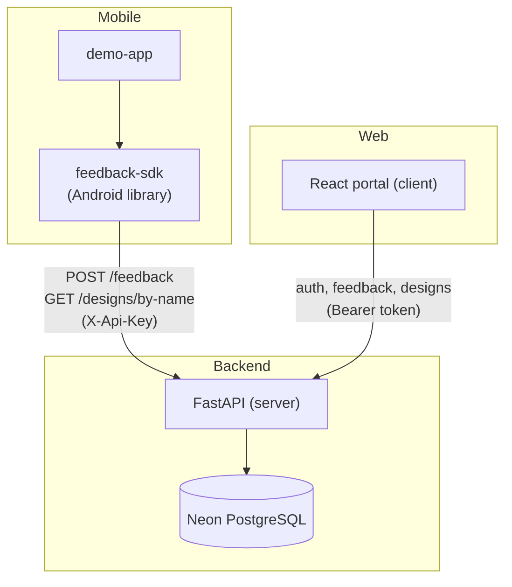
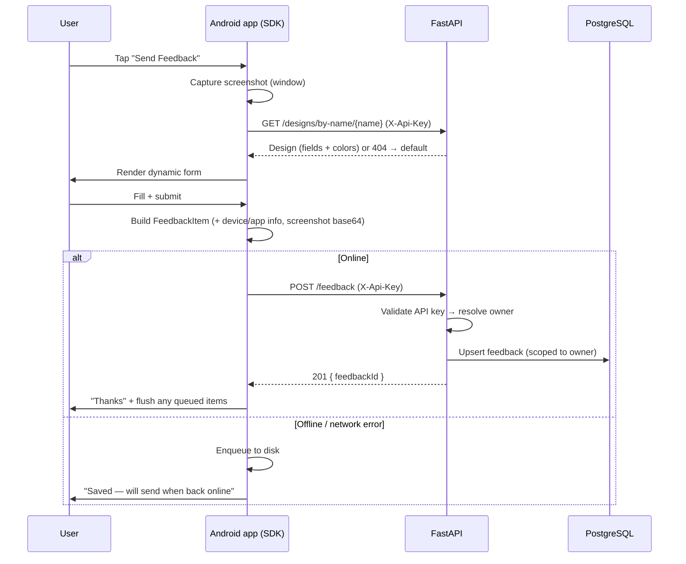
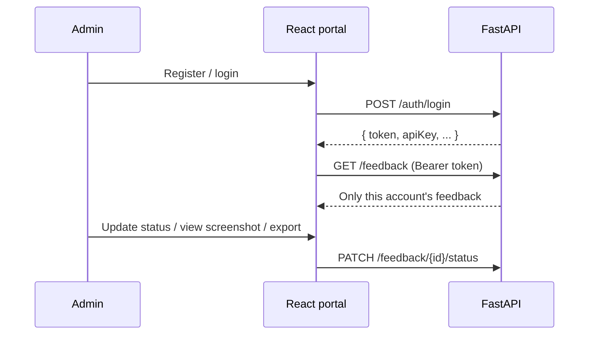

# 🏗️ Architecture

This document explains how the pieces fit together: components, request flows, and the database schema.

---

## 🧩 Components



| Layer | Tech | Responsibility |
|-------|------|----------------|
| SDK | Kotlin, Retrofit, OkHttp, Gson | Capture context, render dynamic forms, submit feedback, queue offline |
| Backend | FastAPI, SQLAlchemy, Pydantic | Auth, validation, persistence, per-account isolation |
| Database | Neon PostgreSQL | Durable storage (feedback, users, designs) |
| Portal | React, Vite, TypeScript | Manage feedback and design forms |

---

## 🔐 Two authentication channels

The backend serves two very different clients, each with its own auth:

| Client | Header | Scope of access |
|--------|--------|-----------------|
| Android SDK | `X-Api-Key: fsdk_...` | Create feedback, read a design by name |
| Web portal | `Authorization: Bearer <token>` | List/read/update feedback, full design CRUD |

- **API keys** are generated per account (`fsdk_` + URL-safe random) and identify the *owner* of submitted feedback.
- **Session tokens** are stateless, **HMAC-SHA256 signed**, and carry the user's email plus a 7-day expiry. They are verified using `AUTH_SECRET`; no server-side session store is needed.

---

## 🔄 Feedback submission flow



For the offline path details, see [Offline Handling](./offline-handling.md).

---

## 🖥️ Portal management flow



---

## 🗄️ Database schema

Three tables, all in PostgreSQL. JSON-ish columns use `JSONB`.

### `users`

| Column | Type | Notes |
|--------|------|-------|
| `email` | `String` | **Primary key** |
| `full_name` | `String` | |
| `password_hash` | `String` | bcrypt hash |
| `api_key` | `String` | unique, indexed; used by the SDK |
| `created_at` | `BigInteger` | epoch ms |

### `feedbacks`

| Column | Type | Notes |
|--------|------|-------|
| `id` | `String` | **Primary key** (the SDK-generated `feedbackId`) |
| `owner_email` | `String` | indexed; ties feedback to a user |
| `user_id` | `String?` | end-user identity (from `setUser`) |
| `user_email` | `String?` | end-user email |
| `answers` | `JSONB` | field id → answer |
| `metadata` | `JSONB` | arbitrary key/values (stored in column `metadata`) |
| `status` | `String` | `pending` / `in_progress` / `resolved` / `archived` |
| `viewed` | `Boolean` | seen in the portal |
| `created_at` / `updated_at` | `BigInteger` | epoch ms |
| `screenshot_url` | `String?` | path to the screenshot endpoint |
| `screenshot` | `LargeBinary` | raw JPEG bytes |
| `device_info` / `app_info` | `JSONB` | captured context |

### `form_designs`

| Column | Type | Notes |
|--------|------|-------|
| `id` | `Integer` | **Primary key**, autoincrement |
| `owner_email` | `String` | indexed |
| `name` | `String` | unique **per owner** (`uq_form_designs_owner_name`) |
| `title` | `String` | form heading |
| `description` | `Text?` | sub-heading |
| `fields` | `JSONB` | ordered list of fields |
| `background_color` | `String` | hex, default `#F4F5FB` |
| `card_color` | `String` | hex, default `#FFFFFF` |
| `title_color` | `String` | hex, default `#15172B` |
| `button_color` | `String` | hex, default `#4F46E5` |
| `created_at` / `updated_at` | `BigInteger` | epoch ms |

> 🧱 **Multi-tenancy:** both `feedbacks` and `form_designs` carry `owner_email`. Every portal query is filtered by the authenticated user, and every SDK call resolves the owner from the API key — so accounts are fully isolated.

---

## 📁 SDK internal structure

```
feedback-sdk/src/main/java/com/example/feedbacksdk/
├── FeedbackSDK.kt            # Public API + state
├── core/                     # FeedbackValidator, FeedbackPayloadBuilder,
│                             #   DefaultDesign, DefaultFormConfig, ScreenshotHolder
├── data/                     # ApiClient, FeedbackApi, CallExtensions,
│                             #   FeedbackRepository, DesignRepository,
│                             #   ScreenshotPreparer, FeedbackQueue, ConnectivityObserver
├── model/                    # FeedbackItem, FeedbackDesign, FeedbackField,
│                             #   FeedbackFormConfig, DeviceInfo, AppInfo
├── ui/                       # FeedbackActivity, FormFieldRenderer
└── util/                     # DeviceInfoCollector, AppInfoCollector,
                              #   ScreenshotCapturer, ScreenshotCache, NetworkUtil
```

| Concern | Where |
|---------|-------|
| Public entry point | `FeedbackSDK` |
| Networking | `data/ApiClient` (Retrofit + `X-Api-Key` interceptor), `data/FeedbackApi` |
| Submission | `data/FeedbackRepository`, `core/FeedbackPayloadBuilder` |
| Dynamic forms | `data/DesignRepository`, `ui/FormFieldRenderer`, `core/DefaultDesign` |
| Screenshots | `util/ScreenshotCapturer`, `util/ScreenshotCache`, `data/ScreenshotPreparer` |
| Offline | `data/FeedbackQueue`, `data/ConnectivityObserver`, `util/NetworkUtil` |
| Context | `util/DeviceInfoCollector`, `util/AppInfoCollector` |

See [Data Models](./data-models.md) for the exact field shapes.
