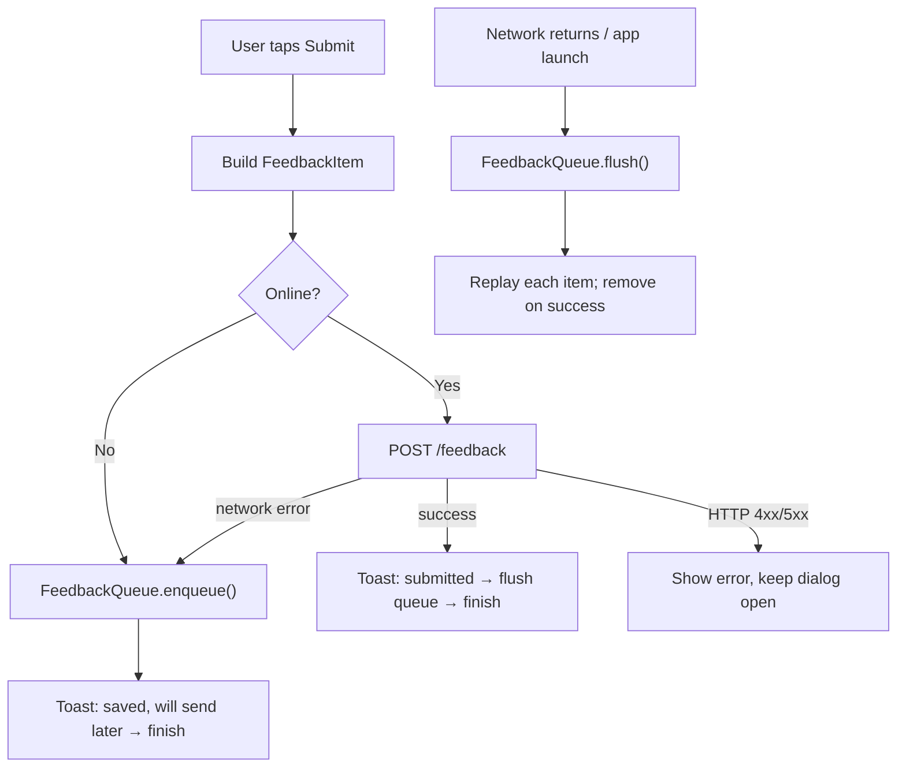

# 📴 Offline Handling

The SDK never loses feedback to a flaky connection. If a submission can't reach the server, it's stored on the device and resent automatically later.

Delivery is **in-process** (no background service / WorkManager): the queue is flushed while the app is running and the network returns, and once more on each `FeedbackSDK.init()` at app launch.

---

## 🔄 Flow

---

## 🧱 The moving parts

| File | Role |
|------|------|
| `util/NetworkUtil.kt` | `isOnline(context)` — checks `ConnectivityManager` for an internet-capable, validated network |
| `data/FeedbackQueue.kt` | Persistent queue + replay logic, all on a single background executor |
| `data/ConnectivityObserver.kt` | Registers one `NetworkCallback`; flushes the queue on `onAvailable` |
| `data/FeedbackRepository.kt` | Splits failures into `onServerError` vs `onNetworkError` |
| `ui/FeedbackActivity.kt` | Branches submit logic based on connectivity / error type |
| `FeedbackSDK.kt` | Starts the observer and triggers an initial flush in `init()` |

---

## 💾 Storage

- Items are serialized as a **JSON array** to `context.filesDir/feedback_sdk_queue.json` (durable internal storage — unlike the screenshot cache, which lives in `cacheDir`).
- The queue is **capped at 100** items; the oldest is dropped when full.
- The screenshot travels **inside** the item as `screenshotBase64`, so replay needs no separate cache files.
- A single shared `Gson` instance handles (de)serialization. All file I/O runs on one background `Executor`, keeping it off the main thread and naturally serialized.

---

## 🚦 Replay policy

`flush()` is guarded by an `AtomicBoolean` (no overlapping runs). If offline, it returns immediately. Otherwise it replays each queued item **synchronously** and decides per response:

| Outcome | Action | Why |
|---------|--------|-----|
| `2xx` success | **Remove** | Delivered |
| `4xx` client error | **Remove (drop)** | Permanent — retrying would loop forever (e.g. duplicate PK, bad payload) |
| `5xx` server error | **Keep + stop** | Transient — try again later |
| `IOException` (network) | **Keep + stop** | Still offline |

When `flush` stops early, the failing item and everything after it are preserved in order.

---

## ⏱️ When does it flush?

1. **Network returns** — `ConnectivityObserver`'s `onAvailable` callback.
2. **After a successful online submission** — drains any older items now that we're clearly online.
3. **On app launch** — `FeedbackSDK.init()` flushes once.

---

## 🙋 User experience

When a submission is queued (offline or a network drop mid-request), the dialog shows:

> *"No connection — your feedback was saved and will be sent automatically when you're back online."*

…and then closes (the submission is treated as done). A **server rejection** (4xx/5xx) is different: the error is shown and the dialog stays open so the user can adjust and retry.

---

## ⚖️ Trade-offs

- **In-process only.** If the user submits offline and never reopens the app, nothing sends until the next launch. A background `WorkManager` job would cover the app-killed case, but was deliberately avoided to keep the SDK dependency-free and simple.
- **Idempotency.** Items keep their original `feedbackId` (the server's primary key) and the backend upserts, so a rare duplicate replay is harmless rather than creating duplicates.
- **No extra dependencies.** Reuses `Gson` (already present via Retrofit's `converter-gson`) and the platform `ConnectivityManager`.
